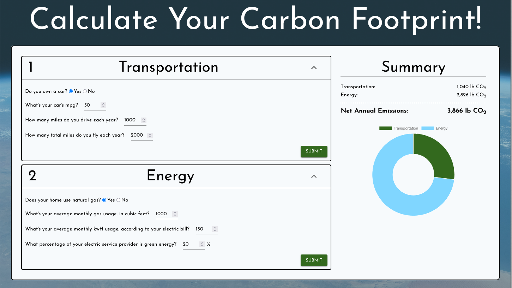

# Carbon Footprint Calculator
An app to track one's personal carbon footprint. Built with `create-react-app` and `ExpressJS`.

## How to run 
1. Run `npm start` from within the `client` directory.
2. Run `npm start` from within the `server` directory.
3. Open http://localhost:3000/